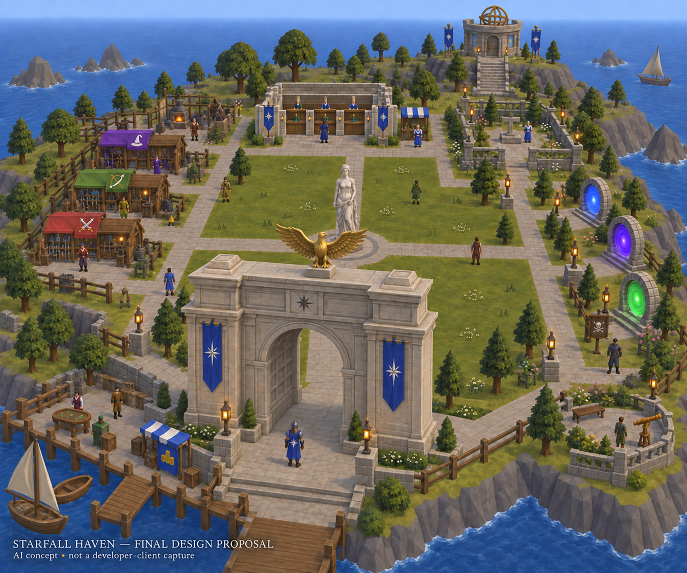

# Starfall Haven: home redesign plan

## Current decision and scope

Latest owner decision: **set the statue aside for now and keep the entrance arch, gold eagle and matching banners**. The statue and pedestal are excluded from the active asset manifest, exports and review views; preserve their existing source files and historical candidates for possible later reconsideration. Leave the planned central green open, with no replacement centerpiece required. Active custom work focuses on the arch/eagle and banners, with **reuse of existing assets wherever possible and custom objects only where required**. Home migration, map/cache deployment, staging, client publication and restart remain outside this asset step.

Current asset work uses the [unified project](../../client/starfall-haven/project/README.md): six active components and one assembled arch, with four review views. The [earlier editable landmark models v1](../../client/starfall-haven/models/v1/README.md) retain the original ten exports, including the deferred statue studies, and their exact native-decoder evidence. Native rendering, performance and registered collision remain untested. These are development assets awaiting acceptance, not a Starfall release. The earlier [design v1 record](../../client/starfall-haven/design/v1/DESIGN_BRIEF.md) retains concept images, its historical generator failure and the post-reboot file checks.

The existing home implementation remains described in [NEITIZNOT_HOME_IMPLEMENTATION.md](../../NEITIZNOT_HOME_IMPLEMENTATION.md). Its reported staged status and pending live acceptance are historical evidence; this plan does not establish what is loaded in a running server. Current source still defines Neitiznot home and its service overlay. Preserve unrelated local changes.

Earlier review: the owner approved the arch appearance and requested more statue face/chest detail and defined eagle feathers. That revision is saved with matching exports, close-up renders and validation, but the owner subsequently stated that the statue still does not resemble the original. **The statue was not artistically accepted and is now deferred.** Increasing procedural mesh detail did not solve its shape/likeness; no further statue modelling, replacement search or related paid integration is needed under the current scope.

Subsequent steering: the owner endorsed the improved workflow and expressly invited further arch/eagle enhancement too. Treat the approved arch composition as a baseline, not a restriction against better geometry. The first [unified asset project](../../client/starfall-haven/project/README.md) now imports independently editable OBJ/MTL sources, assembles the landmarks and generates native exports/checks plus one review page through `client/starfall-haven/Build Assets.ps1`. Its initial build preserves all ten existing native payloads. This is a working asset-workflow prototype, not a newly improved reference-matching statue, full editor, cache writer or client migration.

The owner also asked whether gathering/building a client builder would simplify the project. Proposed direction, review only: reuse the existing `client/developer-client.json` / `tools/Invoke-ClientBatch.ps1` packaging workflow; use Blender for reference-based modelling/sculpting; put source assets, generated exports, native conversion/checks and preview under one content-project manifest and command/UI. Most current files are alternate formats, generated previews or validation evidence and can remain managed outputs rather than separate manual tasks. Add cache/model/object editing and map placement incrementally only after proving this 637/639 cache format, unchanged archive round-trips, delivery, native rendering and collision. The current native decoder probe is a reusable component, not a complete importer or map editor. A full client rewrite is not justified by this home project. Tooling does not replace the sculpting needed to match the statue. This question does not authorize installing an editor, building a replacement client, cache deployment or home migration. Blender's documented capabilities: [sculpting](https://www.blender.org/features/sculpting/) and [format interoperability](https://www.blender.org/features/pipeline/).

## Approved visual direction

This earlier image is an AI concept, not a developer-client capture, surveyed placement sheet or collection of usable 3D models. Its central statue is now deferred; use the open central green described below. Exact meshes, textures and proportions may change to suit existing cache assets. Preserve the composition, remaining landmarks and sense of space; do not create new models merely to reproduce incidental image details.

- One safe, shared public coastal home with a largely open central green, broad paths and services arranged around its edges. Avoid another dense NPC row or several competing banking hubs.
- Southern waterfront arrival: a stone forecourt with a scaled architectural adaptation of the unbuilt Germania triumphal arch, blue star banners and a **gold eagle centered atop it**. Preserve a broad central passage and side routes.
- Central green: open, walkable gathering space. Omit the statue and pedestal for now; no new centerpiece is required.
- Northern edge: main bank and supplies, preparation garden, and an observatory landmark farther behind. Routine services remain accessible at ground level.
- West: equipment stalls and workshop. East: three spaced travel portals. Southwest: Gambler, rewards and waterfront gathering terrace. Outer grounds retain landscaped space for future approved services.
- Provisional footprint about **104 by 88 tiles**, roughly 19% more area than the earlier 96 by 80 concept. Central green target about 30 by 24 tiles; entrance arch initial width study 14–18 tiles. These are design targets, not promised object footprints or final coordinates.
- Expand the perimeter rather than lengthening every routine trip. Keep supplies adjacent to banking and preparation convenient; retain the guide's existing travel menus. No building or landmark should conceal essential services from ordinary gameplay cameras.

The historical architecture reference is the proposed Berlin triumphal arch, not Brandenburg Gate or Munich's Siegestor. The concept's star details, blue banners and ornamental gold eagle are the reference for this fictional adaptation. Historical context: [Berlin heritage record](https://denkmaldatenbank.berlin.de/daobj.php?obj_dok_nr=09055087).

## Asset selection policy

For each required element, follow this order:

1. **Reuse an existing object/NPC unchanged.** Prefer an already-working server service and compatible cache asset.
2. **Compose existing pieces.** Use suitable walls, columns, steps, roofs, platforms and scenery to achieve the shape. Adjust placement and layout around usable native geometry.
3. **Adapt an existing asset only as needed.** Consider supported rotation, scale, recolour or a small geometry adjustment. Verify appearance and collision; recolours/new definitions still count as custom data work. Never alter a globally shared definition in a way that changes unrelated locations.
4. **Create only the missing component.** A new mesh is justified when the inspected alternatives cannot meet a required visual feature or interaction. Do not automatically replace an entire landmark because one part is missing.

Record the asset's object/NPC ID, model references where available, footprint/orientation, actions, candidate image, selected approach, validation status and any custom-work reason in a compact placement/asset register added to this report or linked from it. Mark availability separately from rendered suitability and functional verification. Search the relevant cache families once, preserve the evidence, and revisit only when a requirement or candidate changes.

No reuse percentage or final custom-model count is established yet. The earlier estimate of three landmark projects is historical, **not a commitment to build three new models**. A project can contain reused pieces and one small custom addition. Preserve the approved openness, eagle and arch; the owner explicitly deferred the statue. Record any other material design conflict for review.

## Reuse and exception register

| Element | First approach | Custom work only if needed | Evidence state |
| --- | --- | --- | --- |
| Ten home service NPCs | Retain current NPC models, animations, shop identities and established handlers. Update location-specific guidance when moving. | No new NPC mesh planned. New home wording/wiring is separate from modelling. | Current HomeHub source and Neitiznot report identify all ten; new-home approaches and dialogues untested. |
| Banking | Use existing bank chests/booths and compose a pavilion from suitable existing pieces. Several access points at one main bank. | Only an essential missing architectural piece; no new banking interface planned. | Cache survey identified chest 21301 and booths 16700/26972. Exact look/location undecided. |
| Altar and portals | Start with altar 409 and portals 2465/2466/2467, retaining current actions and travel menus. | A presentation adaptation only where necessary for coherent placement; rendered rings in the image are not promised native models. | Existing overlay uses these IDs. New placement/rendering remains pending. |
| Equipment stalls, workshop, social terrace | Survey native stalls, building pieces, tools, seating and tables. Retain existing shop/repair/reward/Gambler behavior. | A missing structural connector or required prop after survey, rather than a custom building set. | Exact scenery candidates not selected. An attractive prop is not evidence of a working station. |
| Trees, rocks, lamps, fences, docks | Reuse a coherent set of existing objects. Match the native asset palette rather than recreating image detail. | No bespoke ambient-prop family planned. | Detailed visual inventory pending. |
| Central statue and pedestal | Deferred by owner; leave the central green open. | No active custom work or replacement asset required. | Existing meshes, renders and decoder records preserved; excluded from the active build and review. Likeness was not accepted. |
| Entrance arch | One custom pier repeated, separate vault/cornice and plaque, with existing banner geometry. | Preserve central passage through modular placement; native object/clipping registration remains future work. | Editable mesh, masonry detail and actual render saved. Twenty sampled routes through geometry are clear; this is not server collision proof. |
| Gold eagle | Surveyed native Eagle lever models do not fit the outspread sculpture. Use a separate custom eagle and arch support. | Turned head, hooked beak, talons and layered flight feathers; native face-colour gold. | Editable mesh and native decode pass. No new texture/shader required; actual client lighting/culling/performance pending. |
| Observatory | Survey existing observatory/tower pieces and astronomical scenery; assemble native pieces. | A missing celestial instrument or small architectural section if essential. | Exact assets unselected; custom observatory is not the default. |
| Blue banners and star motif | Native object 11675/model 11557 cloth and mount geometry adapted locally; no shared source model overwritten. | Recolour blue/gold, rescale two variants, add star faces front/rear. SVG/transparent PNG masters also saved. | Actual banner meshes decode correctly. Face colours avoid a new texture/UV pipeline; native presentation and ID registration pending. |
| Ground, shore and cliffs | Reuse suitable native coastal terrain and ground materials wherever they meet the layout. | Author/repack only terrain or landscape changes needed for the chosen site. | No site selected. Terrain editing is distinct from new mesh creation. |

Existing availability evidence: [map inspection](../../build/home-review/map-inspection.txt), [original home review](../../HOME_AREA_REVIEW.md), and [HomeHub](../../src/org/dementhium/content/home/HomeHub.java). These sources do not certify the generated image's assets or the proposed island.

## Functional contract

Every NPC or object presented as an interactive service must perform its advertised actions. Scenery may remain decorative, with appropriate examine behavior where supported. Do not show empty dialogue options, dummy shops, fake activity entrances or nonfunctional skilling stations as finished services.

- Retain the guide, melee/ranged/magic merchants, supplies, Slayer, rewards, Gambler, Bob's repair/tools service and skilling guide. Inventory all existing options and affected global callers before relocation; update directions and home naming without changing stocks, currencies, prices or eligibility.
- Retain bank operations, Prayer restoration, standard/ancient/lunar spellbook choices, prayers/curses and current travel categories. Preserve the altar's existing behavior: no new HP or special-energy refill.
- Keep working destination/admission paths, danger labels and confirmations, Teleblock/activity checks, legacy skillcape access and original services. A visually distinct portal must not globally redirect every object with its ID.
- Preserve the Gambler's shared house, original stand, durable journals and recovery. Never test with production account/house/journal data. Preserve all other rewards, personal XP, godmode and access conveniences.
- Workshop space does not authorize adding new skilling mechanics. Any station later included must have an existing verified action or remain explicitly proposed; do not infer usability from its name/model. A progression corner reuses rewards/legacy access and does not authorize a new cape interface.
- Keep passages and NPC approaches clear on all relevant sides. The arch cannot be represented by a single solid rectangle across its opening; align modular collision or prove an appropriate alternative. Keep the central green traversable without a statue or pedestal obstruction.
- Plan all home callers together: new-player arrival, home teleport/command, ordinary death fallback, tutorial/camera and home return objects. Saved-player locations and intentional encounter exits need explicit treatment, not a blanket teleport or account rewrite.

## Proposed execution after implementation authorization

1. **Asset and site survey.** Produce the bounded asset register and compare native coastal sites against the required footprint, openness, camera composition and existing content. Prefer reusing suitable geography. Do not displace working content or choose a managed-instance home by default. If dynamic map reuse becomes necessary, read the instance context before selecting lifecycle/admission behavior.
2. **Choose the minimum custom scope.** Present native candidates and assembled landmark alternatives, then list only indispensable missing pieces. Revise earlier custom estimates downward wherever reuse succeeds. Record material compromises to the approved composition.
3. **Prove only the required content pipeline.** Existing placement may use server-side scenery mechanisms. Where new definitions/models/maps are necessary, establish isolated candidate cache handling, archive/reference metadata and update integrity, compatible model loading, matching collision and real developer-client rendering. Prove unchanged data round-trips before changed archives. A new model or coastline cannot be certified by existing client packaging tests alone.
4. **Build a minimal development preview.** Show actual bank/service footprints, arch plus eagle, open central green, paths and outer bounds using selected assets. Tour with normal camera/roof settings and a few players before investing in detailed scenery or migrating home. Preserve the current home during this preview.
5. **Complete the retained service integration.** Connect and verify every advertised dialogue/action, then finish scenery using the selected native palette. Add custom components only from the recorded gap list. Read subsystem reports when their behavior is affected.
6. **Verify and release the exact candidate.** Follow [testing guidance](../../tests/TESTING.md) and [server tooling](../../tools/README.md) for ordinary Java batches: Prepare before edits, scoped Debug/Verify, exact-family Stage with backups/hashes. Use the separate [developer-client workflow](../../client/DEVELOPMENT.md) and a validated cache procedure where required. Do not restart merely because staging succeeds. Retain the single developer-client launcher and approved custom assets, including item 20430.

Current technical boundary: [CLIENT_EDITABILITY_REVIEW.md](../../CLIENT_EDITABILITY_REVIEW.md) and [CLIENT_WORKFLOW.md](CLIENT_WORKFLOW.md) do not establish end-to-end custom map authoring/repacking. No alternative client migration, general full-client repair or new custom rendering system is presumed necessary or authorized by this plan. Recheck current tooling when implementation begins.

## Acceptance and test selection

The expected result is a spacious, usable shared home whose visible services work through normal production entry paths, with compatible rendered scenery and movement. Visual acceptance must use ordinary players with godmode disabled.

- Extend/reuse HomeHubRegression for the selected cache, registration, real NPC/object click dispatch, walk-to-interact approaches, all menus/dialogues, bank/shop/repair identity, book changes, travel safety and home-return callers. Include stale/remote choices and independent simultaneous players. Helpers alone do not establish natural packet/queue integration.
- Select GamblerRegression for relocation/stand recognition/shared-house regression, with isolated financial fixtures and conservation/recovery checks. Existing Neitiznot results are historical evidence, not a receipt for the new layout.
- Add focused map/model checks for affected archive loading, footprints, orientation, arch passage/side routes, open central routes, boundary crossings and relevant object visibility. Run live client checks for actual materials, animation where applicable, roofs, camera obstruction, clicks and cache delivery.
- Tour all advertised services and destinations, and verify arrival, death/home returns and reconnects. Check two-player interactions plus the visual feel of a sparse and a busier gathering. Preserve a single obvious banking focus.
- Broaden tests only for a concrete affected dependency, failure or unresolved risk. Record selected coverage, measured durations and remaining boundaries. Automated passes do not establish live rendering or release acceptance.

Quest implementation, solo minigame concepts, Summoning-specific development, Dungeoneering overhaul and lobby/startup branding remain deferred. Reserved space does not authorize these features.

## Handoff and evidence state

- Statue deferral implemented in the active manifest and current review. Seven retained exports match their earlier native payloads; four-view browser checks and all source-preservation checks pass. Current candidate, durations and scope evidence are recorded in the [asset project README](../../client/starfall-haven/project/README.md).

- Authorized now: arch/eagle meshes, renders and banner artwork, with further refinement permitted; preserve references and reuse supporting scenery. Statue and pedestal are deferred. Runtime migration remains outside this asset step.
- Changed contract: the active asset build/review excludes the statue and pedestal; their editable sources and historical outputs remain preserved. Future scenery selection still minimizes custom work while preserving the required design and functionality.
- Resume context: this plan; Neitiznot implementation for current services; client/map reports above; affected subsystem reports only when needed.
- Next concrete work: review the actual mesh renders and remaining visual differences; establish an isolated native rendering/performance and clipping preview before calling the candidates game-ready. Preserve the higher-detail sources if optimized derivatives are needed. Exact site, supporting scenery register and cache/map authoring pipeline remain undecided.
- Starfall asset state: editable meshes, actual renders, banner SVG/PNG and offline viewer built. See the asset project README and candidate receipts for current checks and durations; earlier ten-model evidence remains historical. Statue studies are preserved outside the active build. Gameplay implementation: not started. Automated gameplay verification: not run. Staged: no. Loaded: no Starfall release. Live accepted: no.
- This documentation update: source-doc backups, hash manifest, change checks and copied-image identity evidence under `build/home-plan-docs/4061965522a445b098333dc7fe9e738d/`. Documentation/link checks only; no gameplay suite or compilation is warranted.
- Subsequent model batch: new isolated authoring/export files under `client/starfall-haven/models/v1/`; asset logs, native source extracts, retained iteration previews and document backups/hashes under `build/starfall-models-v1/`. Earlier design and release records remain preserved.
- Existing source/runtime state: no server Java, runtime classes, cache, client, launcher, accounts or journals changed. Existing release backups/receipts remain authoritative for their own batches; no loaded-runtime identity is newly asserted.
- Remaining acceptance: real asset selection, map feasibility, development preview, service integration, selected automated checks and live tour must all complete before this home can be called ready.
